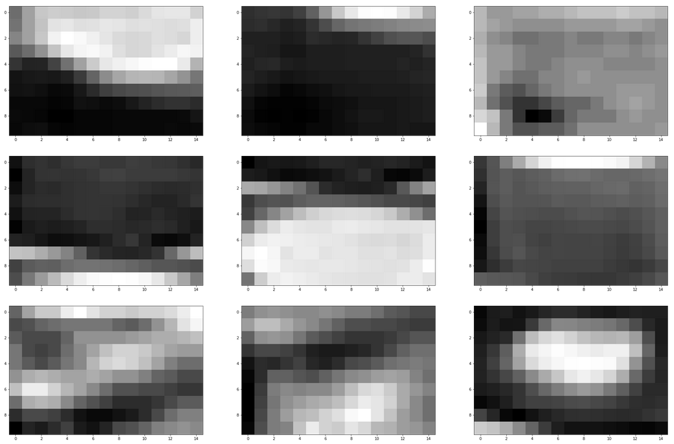

Traffic Light Classifier
========================

## Introduction

The final project for the Udacity Intro to Self-Driving Cars was a
traffic light classifier.

> In this project, you’ll use your knowledge of computer vision
> techniques to build a classifier for images of traffic lights!
> You'll be given a dataset of traffic light images in which one of
> three lights is illuminated: red, yellow, or green.

> In this notebook, you'll pre-process these images, extract features
> that will help us distinguish the different types of images, and use
> those features to classify the traffic light images into three
> classes: red, yellow, or green. The tasks will be broken down into a
> few sections:

> 1. Loading and visualizing the data. The first step in any
>    classification task is to be familiar with your data; you'll need
>    to load in the images of traffic lights and visualize them!

> 2. Pre-processing. The input images and output labels need to be
>    standardized. This way, you can analyze all the input images
>    using the same classification pipeline, and you know what output
>    to expect when you eventually classify a new image.

> 3. Feature extraction. Next, you'll extract some features from each
>    image that will help distinguish and eventually classify these
>    images.

> 4. Classification and visualizing error. Finally, you'll write one
>    function that uses your features to classify any traffic light
>    image. This function will take in an image and output a
>    label. You'll also be given code to determine the accuracy of
>    your classification model.

> 5. Evaluate your model. To pass this project, your classifier must
>    be >90% accurate and never classify any red lights as green; it's
>    likely that you'll need to improve the accuracy of your
>    classifier by changing existing features or adding new
>    features. I'd also encourage you to try to get as close to 100%
>    accuracy as possible!

There were two criteria to pass:

1. The classifier had to have at least a 90% accuracy.
2. The classifier couldn't misclassify green lights as red lights.

My submitted code used a single feature and had 98.3% accuracy,
misclassifying 5 test images; all of the misclassified images were
green lights misclassified as red.

I was able to improve this to 99.0% accuracy, but my experiments in
adding a second feature were unsuccessful.

## Files

+ [Improved_Traffic_Light_Classifier.ipynb](Improved_Traffic_Light_Classifier.ipynb)
  is the notebook where I've been trying out various things.
+ [Submitted_Traffic_Light_Classifier.md](Submitted_Traffic_Light_Classifier.md) is
  the final project as I submitted it.
+ [Traffic_Light_Classifier.ipynb](Traffic_Light_Classifier.ipynb) is
  the original notebook.
+ [helpers.py](helpers.py) and [test_functions.py](test_functions.py)
  are Udacity-provided utility modules.
+ [tlc.py](tlc.py) is a command-line version of the classifier for
  quickly checking changes where I don't need to visualise the output.

## Standardizing the input data

> This traffic light dataset consists of 1484 number of color images
> in 3 categories - red, yellow, and green. As with most human-sourced
> data, the data is not evenly distributed among the types. There are:

> * 904 red traffic light images
> * 536 green traffic light images
> * 44 yellow traffic light images

> *Note: All images come from this [MIT self-driving car
> course](https://selfdrivingcars.mit.edu/) and are licensed under a
> [Creative Commons Attribution-ShareAlike 4.0 International
> License](https://creativecommons.org/licenses/by-sa/4.0/).*

The first step in any of these types of problems is to figure out how
to pre-process the data. I found that just resizing the images was
very successful; attempts at equalizing the images using histograms on
various color spaces, and tried equalising both before and after the
resize.

1. YCrCb, a color space optimised for digital images equalised on the
   luma channel. Equalising before resizing dropped performance to
   97.0% accuracy, while after resizing dropped performance to 96.6%
   accuracy.
2. HSV with equalisation on the V channel: both before and after
   resizing dropped performance to 97% with a green light
   misclassified as red.
3. HSL with equalisation on the L channel: before dropped performance
   to 95.6%, and after dropped performance to 95.3%. Both
   misclassified a green light as red.

I stopped experimenting with histogram equalisation after these three
in the interest of time. My final pipeline only performed the resize.

As a side note, I was hoping to also be able to use PyTorch to build a
classifier, but the dataset is too small to train it correctly.

## Features

I was able to get one feature working; the other features I
experimented with decreased performance.

### HSV feature

The HSV feature I came up with works along the following steps:

1. Consider a rectangle in the middle of the image: I cut some of the
   edges off to produce an image with dimensions 15x30. Taking the
   vertically centre portion of the image meant I could focus on the
   light itself. The top and bottom removal were needed to build 15x10
   bands inside the image, each one intended to cover each of the
   three possible lights.
2. I computed the maximum brightness for each of the three bands. The
   brightest of these is expected to be the traffic light.
   
Here's a visualisation of this applied to randomly-chosen sample
images, with the bands colormapped to gray to make the intensity
values more apparent:

These are a red, yellow, and green light.

### Color bands

I've also been experimenting with a color bands feature. Unfortunately,
I couldn't get this quite right. Some of the things I tried include

1. Splitting the image into bands and finding the dimmest of these
   bands (e.g. the color that has been filtered out).
2. Taking the average brightness of each of the three color channels.

## Follow up reading

The grader suggested the following resources to follow up on this
project and explore it further:

* Anthony Sarkis' post [Self-Driving Cars: Implementing Real-Time Traffic Light Detection and Classification in 2017](https://medium.com/@anthony_sarkis/self-driving-cars-implementing-real-time-traffic-light-detection-and-classification-in-2017-7d9ae8df1c58) provides a deeper look at traffic light classification.
* To deal with some of the washed out images, he suggested equalising on the V channel; the OpenCV docs have a tutorial on [Histogram Equalization](https://docs.opencv.org/2.4/doc/tutorials/imgproc/histograms/histogram_equalization/histogram_equalization.html).
* Scikit's [preprocessing module documentation](https://scikit-learn.org/stable/modules/preprocessing.html) has more information on encoding labels.
